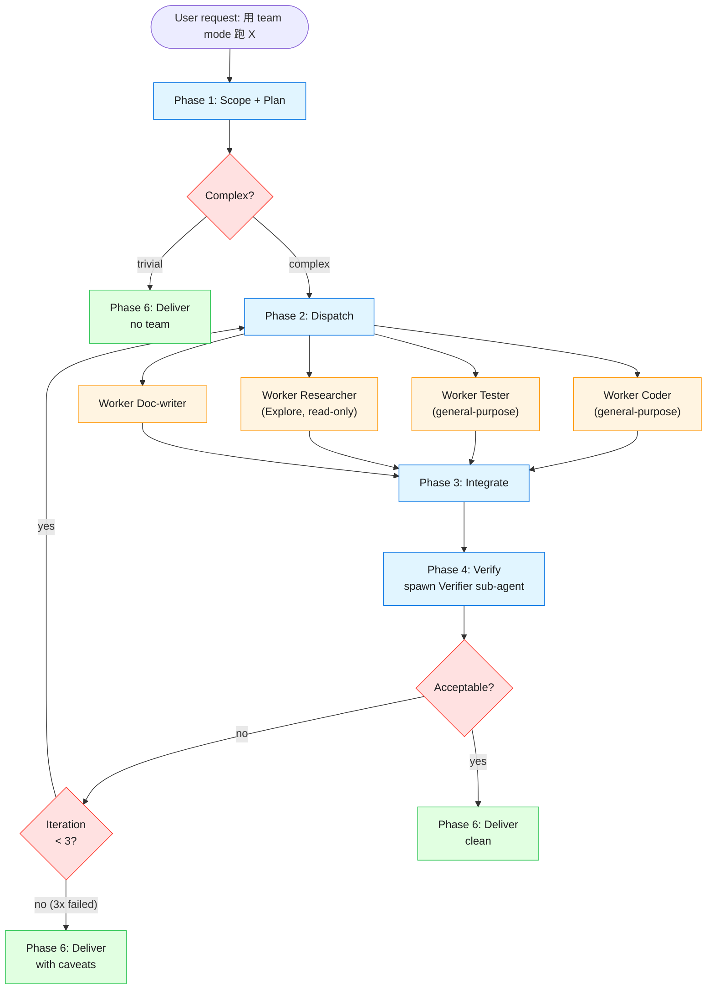

# Architecture

Visual representation of the Mavis Team Mode skill structure, both as static text and as Mermaid diagrams (renderable on GitHub, Zcode doc, etc).

## High-level flow

```
┌─────────────────────────────────────────────────────────────────┐
│                          User in Zcode                          │
│                  "用 Mavis team mode 帮我做 X"                 │
└─────────────────────────────┬───────────────────────────────────┘
                              │
                              ▼
┌─────────────────────────────────────────────────────────────────┐
│  Zcode loads mavis-team-mode SKILL.md (frontmatter triggers)    │
│  - description: matches user intent                            │
│  - SKILL.md body: instructions for Leader                      │
└─────────────────────────────┬───────────────────────────────────┘
                              │
                              ▼
┌─────────────────────────────────────────────────────────────────┐
│  PHASE 1: SCOPE + PLAN (Leader, ~2 min)                         │
│  - Understand user goal                                         │
│  - Decide: do I do this alone, or do I split it?                 │
│  - Output: Team Plan (goal + 1..N subtasks)                     │
└─────────────────────────────┬───────────────────────────────────┘
                              │
                  ┌───────────┴───────────┐
                  ▼                       ▼
              [complex]              [trivial]
                  │                       │
                  ▼                       │
   ┌──────────────────────────┐          │
   │  PHASE 2: DISPATCH        │          │
   │  parallel sub-agents      │          │
   └──────────────┬─────────────┘          │
                  │                         │
   ┌──────────────┼─────────────┐          │
   ▼              ▼             ▼          │
┌────────┐   ┌────────┐   ┌────────┐       │
│ Worker │   │ Worker │   │ Worker │       │
│  Coder │   │ Tester │   │Research│       │
└────┬───┘   └───┬────┘   └───┬────┘       │
     │           │            │            │
     ▼           ▼            ▼            │
  ┌─────┐    ┌─────┐     ┌─────┐          │
  │ Src │    │Tests│     │ Doc │          │
  │code │    │ run │     │ info │          │
  └──┬──┘    └──┬──┘     └──┬──┘          │
     │          │           │              │
     └──────────┼───────────┘              │
                ▼                          │
   ┌──────────────────────────┐            │
   │  PHASE 3: INTEGRATE       │            │
   │  Leader synthesizes       │            │
   │  outputs into v1          │            │
   └──────────────┬─────────────┘            │
                  │                          │
                  ▼                          │
   ┌──────────────────────────┐            │
   │  PHASE 4: VERIFY          │            │
   │  Spawn Verifier sub-agent │            │
   │  (different conversation  │            │
   │   to avoid bias)          │            │
   └──────────────┬─────────────┘            │
                  │                          │
            ┌─────┴─────┐                   │
            ▼           ▼                   │
         [pass]      [fail]                  │
            │           │                   │
            │           └───► PHASE 5       │
            │                 ITERATE        │
            │                 (max 3x)       │
            │                 back to P2     │
            ▼                                │
   ┌──────────────────────────┐            │
   │  PHASE 6: DELIVER         │◄──────────┘
   │  Summary + path to result │
   │  Cleanup task files       │
   └────────────────────────────┘
```

## Mermaid diagram (renders on GitHub)



## File-level architecture

> Line counts and test counts as of 2026-07-24 (v1.3.11). Run `make info`
> or `wc -l` for current numbers — these can drift.

```
mavis-team-mode-skill/
│
├── SKILL.md                       (201 lines) — Zcode loads this on trigger
│   ├── YAML frontmatter            triggers on description match
│   └── Markdown body               instructions for Leader
│
├── agents/                        (7 files) — sub-agent prompt templates
│   ├── leader.md                   (127 lines) — Team Plan format, 6 phases
│   ├── verifier.md                 (64 lines) — independent review checklist
│   ├── worker-coder.md             (87 lines)
│   ├── worker-tester.md            (54 lines)
│   ├── worker-researcher.md        (58 lines)
│   ├── worker-doc-writer.md        (54 lines)
│   └── worker-reviewer.md          (64 lines)
│
├── examples/                      (4 files) — concrete use cases
│   ├── refactor-large-module.md
│   ├── bug-hunt.md
│   ├── new-feature.md
│   └── research-then-implement.md
│
├── references/                    (3 files) — deeper docs, on-demand
│   ├── verification-checklist.md
│   ├── deepseek-setup.md
│   └── troubleshooting.md
│
├── scripts/                       (7 files) — install/validate/benchmark/package
│   ├── install.sh                  (498 lines) — bash, all platforms
│   ├── install.ps1                 (241 lines) — PowerShell, Windows native
│   ├── validate.sh                 (145 lines) — bash
│   ├── validate.ps1                (104 lines) — PowerShell
│   ├── package.sh                  (348 lines) — build platform-specific archives
│   ├── validate_yaml.py            (224 lines) — pure-Python YAML
│   └── benchmark_tokens.py         (224 lines) — token cost estimator
│
├── docs/                          (6 files) — architecture & decision logs
│   ├── ADR-001-team-mode-recreation.md
│   ├── ADR-002-security.md
│   ├── PERFORMANCE.md
│   ├── ARCHITECTURE.md             ← this file
│   └── WINDOWS.md                  (150 lines) — Windows-specific guide
│
├── examples/prototype-todo-app/   — real working web app
│   ├── server/server.py            (279 lines, defense-in-depth HTTP)
│   ├── client/index.html           (324 lines, validation + UI)
│   ├── test_e2e.py                 (20 tests, base HTTP + CRUD)
│   ├── test_e2e_extended.py        (23 tests, methods + unicode + concurrency)
│   ├── test_e2e_advanced.py        (5 tests, slow client + idempotency)
│   ├── run_e2e.ps1                 (Windows runner)
│   └── README.md
│
├── .github/workflows/              — CI (12 jobs: lint x3, py x5, win, integration, stats, package)
├── .shellcheckrc
├── Makefile                        — `make help/install/test/lint` shortcuts
├── index.html                      — GitHub Pages-friendly landing
├── README.md
├── INSTALL.md
├── VALIDATION.md
├── CHANGELOG.md
├── CONTRIBUTING.md
├── SECURITY.md
└── LICENSE                         (MIT)
```

## Decision boundaries

| Decision | Who decides | Evidence required |
|----------|-------------|-------------------|
| Use Team Mode? | Leader (Phase 1) | Task has 3+ independent steps |
| Number of subtasks | Leader (Phase 1) | Each subtask is verifiable |
| Sub-agent type per subtask | Leader (Phase 1) | "explore" if read-only, "general-purpose" if writes |
| Parallel vs serial | Leader (Phase 1) | No dependencies between subtasks |
| Max iteration count | Hard-coded (3) | Saved as 3 in SKILL.md, no env override |
| What counts as "pass" | Verifier (Phase 4) | All acceptance criteria checked |
| Whether to deliver or fail | Leader (Phase 6) | After 3 failed iterations → deliver with caveats |

## Token economics

> **Estimated**, not measured. See `docs/PERFORMANCE.md` for the actual
> 4-chars-per-token heuristic numbers.

- **Without skill**: average task plan = ~3,000 tokens in main context (Leader writes detailed prompts inline)
- **With skill (progressive load)**: ~5,586 tokens on activation, additional agents loaded only if invoked
- **Net change**: skill costs **+86%** vs inline baseline, but enables parallel execution
- The skill is a **time-saver, not a token-saver** — use it when wall-clock matters more than tokens.


## See also

- [ADR-001 Team Mode Recreation](ADR-001-team-mode-recreation.md)
- [ADR-002 Security Posture](ADR-002-security.md)
- [PERFORMANCE](PERFORMANCE.md)
